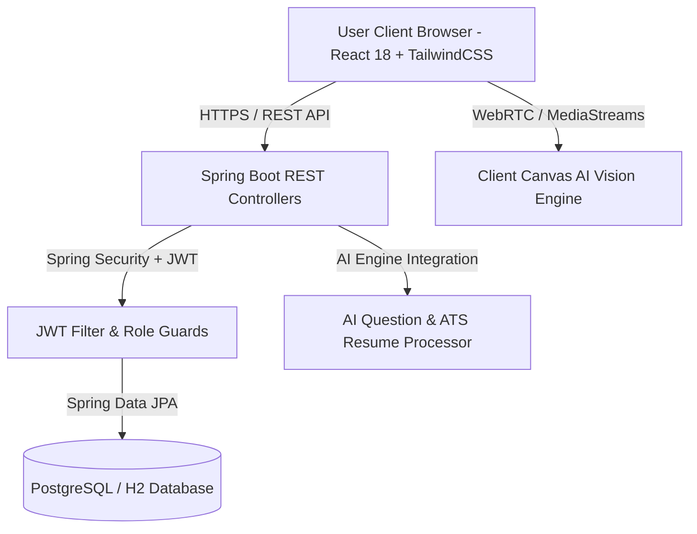

# 🎓 EduFlow-AI — Next-Gen AI-Powered Academic ERP & Intelligent Learning Ecosystem


---

## 📌 Executive Summary

**EduFlow-AI** is an enterprise-grade, full-stack Academic Management ERP and Intelligent Learning Platform tailored for modern higher educational institutions. It seamlessly unites institutional administration, automated attendance checking, virtual classrooms, coding assessment sandboxes, AI resume ATS scanning, real-time computer vision mock interviews, placement drive management, and real-time executive analytics into a single cohesive, high-performance web platform.

Built with a **Spring Boot 3.x (Java 17)** RESTful backend architecture, **React 18** frontend, **WebRTC AI Vision Stream**, and **PostgreSQL/H2 JPA Database**, EduFlow-AI empowers Students, Faculty Members, and Academic Administrators with state-of-the-art tools designed for speed, security, and exceptional user experience across both **Dark Mode** and **Light Mode**.

---

## 🌟 Key Architecture & System Highlights



- **Role-Based Security Model (RBAC)**: Fine-grained security for `ADMIN`, `FACULTY`, and `STUDENT` roles enforced via Stateless JWT Authentication.
- **Dynamic Dual-Theme System**: Seamless dark and light mode UI featuring curated contrast colors, smooth CSS transitions, and local storage persistence.
- **Real-Time ERP Timetable Synchronization**: Automated mapping between institutional master timetables, active period detection, and virtual classroom generation.
- **Computer Vision WebRTC AI Interviewer**: Real-time webcam frame processing calculating Face Confidence %, Eye Contact Index %, Posture Detection, and Live Audio Transcription.
- **Integrated Coding Assessment Sandbox**: Online code execution environment tracking submission analytics, daily streaks, problem difficulty tiers (Easy/Medium/Hard), and leaderboard rankings.
- **Virtual Mini Classrooms**: Complete Google Classroom equivalent supporting Stream Announcements, Multi-format Classwork (PDFs/Links), Assignments & Submissions, MCQ/Descriptive Assessments with automated evaluation, and AI-summarized Lecture Timelines.
- **Smart Attendance & Geofenced OD Approval**: Facial verification check-ins, automated attendance percentage calculations, and digital On-Duty (OD) / Leave request workflow.

---

## 🏛️ Comprehensive Feature Breakdown by Module

### 1. 📢 Virtual Course Classrooms (`/student/classroom` & `/classroom`)
Virtual course rooms connect faculty members and enrolled students with 7 interactive sub-modules:
- **Stream & Discussion Hub**: Broadcast course updates, pin critical notices (`📌 Pinned`), and engage in nested discussion threads.
- **Classwork & Learning Materials**: Publish structured course notes, PDF documents, video lectures, and external web resource links categorized by Units.
- **Assignment Management Console**:
  - Faculty publish assignments with due dates, maximum marks, attached files, and late submission rules.
  - Students submit files or text answers with immediate submission receipts.
  - Faculty review, score, and provide qualitative feedback.
- **Online MCQ & Descriptive Assessment Engine**:
  - Timed assessments supporting Multiple Choice Questions (MCQ), short-answer descriptive, and inline coding questions.
  - Features question/option shuffling, paste prevention safeguards, automated grading for MCQs, auto-publishing results, and student performance review modals.
- **Lecture History & AI Syllabus Timeline**:
  - Log daily lecture topics, covered learning objectives, and completion dates.
  - One-click AI Lecture Summary generation distilling class content into quick revision key points.
- **Student Gradebook & Class Analytics**: Comprehensive performance dashboards tracking assessment averages, assignment completion rates, and individual progress.
- **Course Roster & People Directory**: Full view of course instructors and enrolled class section roster.

---

### 2. 📹 WebRTC Real-Time AI Mock Interview Room (`/student/interview`)
An advanced career readiness environment providing simulated technical and behavioral mock interviews:
- **WebRTC Camera Stream & Picture-in-Picture Viewport**: Live video feed processing canvas frames every 300ms.
- **Real-Time Face Confidence & Posture Analyzer**:
  - Calculates **Face Confidence %** (0–100%) and **Eye Contact Index %** using luminance distribution, skin-tone hue detection, center target alignment, and frame-to-frame variance analysis.
  - Live HUD Target Bounding Overlay (`REC • AI VISION` live dot, glowing neon corner targets) with posture stability warnings (`⚠ Slight Head Tilt`, `🎯 Perfect Eye Alignment`).
- **Live Terminal Speech Console**: Simulated speech recognition engine displaying candidate answers in real time with dynamic audio waveform visualizer.
- **Domain-Specific Interviews**: Choose specialized interview tracks including Full Stack Developer, Data Scientist, DevOps Engineer, Cloud Architect, and AI Engineer.
- **Evaluation Scorecard**: Generates final scores combining technical answer quality, clarity rating, and average face confidence percentage.

---

### 3. 💻 Coding Performance Hub (`/student/coding`)
A full-featured competitive programming and skill assessment platform:
- **Real-Time Analytics & Streaks**: Track Current Streak, Longest Streak, Submission Success Rate %, Total Solved count broken down by difficulty (Easy, Medium, Hard), and Average Score.
- **Problem Directory & Challenge Workspace**: Interactive programming challenges with full problem statements, input/output test cases, constraints, and initial code stubs.
- **Code Execution Sandbox**: Web-based code editor with language selection (Java, Python, C++, JavaScript), standard output console, and test case execution runner.
- **Solving History & Submission Audit**: Per-question submission log recording submission timestamps, execution time, pass percentage, and score.

---

### 4. 📄 AI Resume Analyzer & ATS Score Calculator (`/student/resume`)
Empowers students to optimize their resumes for corporate applicant tracking systems:
- **Resume Upload & Parsing**: Upload PDF or Word documents for instant text extraction.
- **ATS Compatibility Score**: Multi-factor scoring assessing keyword density, format compatibility, section layout, and industry relevance.
- **Keyword Gap Analysis**: Identifies missing technical skills, frameworks, and certifications based on target job descriptions.
- **Actionable Optimization Recommendations**: Direct feedback on bullet point impact, quantifiable achievements, and contact information placement.

---

### 5. 📅 Master Timetable & ERP Schedule Matrix (`/student/timetable`)
Automated academic schedule management:
- **Interactive Weekly Grid**: Visual matrix displaying Monday–Friday schedule across 6 daily periods (P1–P6) with dedicated Short Break and Lunch Break dividers.
- **Active Class Detection**: Live indicator highlighting current ongoing class period with animated pulse indicator (`● LIVE CLASS`).
- **Faculty & Room Mapping**: Displays subject acronyms (`IOT`, `BT`, `PE-III`, `MP`, `BI`), course codes, assigned faculty members, and classroom/lab room codes.
- **Printable Schedule**: One-click printable PDF view formatted for academic printing.
- **Academic Calendar Modal**: Full institutional calendar overlay (June–October) detailing working days (W.D.), day orders (D.O.), CIA exam dates, and official holidays.

---

### 6. ⏱️ Smart Attendance & Geofenced Check-in (`/student/attendance`)
Modernized attendance verification system:
- **Overall Attendance Index %**: Real-time progress ring tracking total attended vs. conducted sessions across all subjects.
- **Subject-Wise Breakdown**: Detailed per-subject attendance percentages with threshold warnings (e.g. `< 75%` warning badge).
- **Face Recognition & Geofenced Verification**: 
  - **Instant FaceID-style Scanning**: Utilizes `@vladmandic/face-api` running entirely client-side to capture and generate a 128D face descriptor instantly upon detection.
  - **Secure Identity Binding**: Matches live webcam face descriptor against registered student ID photos with a strict configurable distance threshold (e.g. 0.55) to prevent spoofing.
  - **Geofenced Check-in**: Validates GPS location against institutional boundaries alongside face verification for dual-layer security.
- **On-Duty (OD) & Leave Application Portal**: Submit medical leave or institutional OD requests with attached document proofs, status tracking (`PENDING`, `APPROVED`, `REJECTED`), and faculty approval workflow.

---

### 7. 💼 Career & Placement Portal (`/student/career`)
Connecting students with institutional recruitment drives:
- **Live Recruitment Drives**: Explore upcoming campus placement drives from top technology companies.
- **Application Tracker**: Manage application status (`Applied`, `Shortlisted`, `Interview Scheduled`, `Offered`).
- **Placement Analytics**: Institutional placement statistics, average salary packages, and company visit history.

---

### 8. 📊 Executive Analytics & Admin Controls (`/admin/analytics` & `/admin/dashboard`)
Comprehensive institutional administration:
- **Department-Wise Breakdown**: Real-time breakdown of students, faculty accounts, and active classroom sessions across CSE, IT, ECE, EEE, Mech, Civil, AI&DS, CSBS, and M.Tech CSE departments.
- **System Health & Logs**: Database query latency, active JWT sessions, and server uptime monitoring.
- **Faculty & Student Account Management**: Register new faculty members, assign department affiliations, and adjust user roles.

---

## 🛠️ Technology Stack & Dependencies

### Backend Framework & Core
- **Java 17**: LTS Java runtime environment.
- **Spring Boot 3.5.15**: Core application framework.
- **Spring Security & Spring JWT**: Stateless token-based security and RBAC filter chains.
- **Spring Data JPA & Hibernate**: Object-relational mapping and repository abstraction.
- **PostgreSQL / H2 Database**: Relational database storage (H2 embedded in development, PostgreSQL in production).
- **Lombok**: Boilerplate reduction for data models, DTOs, and builders.
- **Maven**: Dependency management and build tool.

### Frontend Framework & Styling
- **React 18.3.1**: Component-based UI library.
- **Vite 6.x**: High-performance frontend build tool and dev server.
- **TailwindCSS 3.4.1 & Custom CSS Variables**: Utility-first styling combined with dynamic theme tokens (`--bg-primary`, `--text-main`, `--card-bg`).
- **FontAwesome 6.4.0 (Free Vector Icons)**: Professional iconography across all modules.
- **Chart.js & React-Chartjs-2**: Interactive visual analytics, radar charts, and attendance bar graphs.

### Real-Time, Vision & Media APIs
- **WebRTC (`navigator.mediaDevices.getUserMedia`)**: Camera video stream capture.
- **HTML5 Canvas Context 2D**: Real-time image frame extraction and pixel luminance analysis.
- **Web Speech API**: Live audio speech recognition and dynamic voice transcription.
- **`@vladmandic/face-api`**: TensorFlow.js models running client-side for ultra-fast facial recognition (`tiny_face_detector`, `face_recognition_net`) and FaceID-style authentication without uploading video.

---

## 📂 Project Repository Structure

```text
EduFlow/
├── eduflow-backend/                  # Spring Boot Backend Server
│   ├── src/main/java/com/eduflow/
│   │   ├── config/                   # SecurityConfig, CorsConfig, JwtConfig
│   │   ├── controller/               # REST Controllers (Auth, Classroom, FaceVerification, etc.)
│   │   ├── dto/                      # Data Transfer Objects & API Schemas
│   │   ├── entity/                   # JPA Entity Models (User, Classroom, Assessment, etc.)
│   │   ├── repository/               # Spring Data Repositories
│   │   ├── security/                 # JwtTokenProvider, JwtAuthFilter, UserDetails
│   │   └── service/                  # Business Logic Services (including FaceVerificationService)
│   ├── src/main/resources/
│   │   ├── application.properties    # Database & Server Configuration
│   │   └── data.sql                  # Initial Database Seed Script
│   └── pom.xml                       # Maven Build Manifest
│
└── eduflow-frontend/                 # React 18 Vite Frontend Application
    ├── public/
    │   ├── models/                   # Pre-trained TensorFlow.js Face API Weights
    │   └── students_photos/          # Registered Student Identification Photos
    ├── src/
    │   ├── assets/                   # Static Media & Icons
    │   ├── components/               # Reusable UI Components
    │   │   ├── attendance/           # MobileFaceVerification, QRScanner
    │   │   ├── analytics/            # FacultyAnalytics, StudentGradebook
    │   │   ├── career/               # InterviewDashboard, CodingDashboard, NotificationBell
    │   │   ├── layout/               # StudentPortalLayout, FacultyLayout, AdminLayout
    │   │   ├── ClassroomAssignments.jsx
    │   │   ├── ClassroomAssessments.jsx
    │   │   ├── ClassroomMaterials.jsx
    │   │   ├── ClassroomStream.jsx
    │   │   └── ClassroomLectureHistory.jsx
    │   ├── pages/                    # Main Portal Pages
    │   │   ├── ClassroomDashboard.jsx
    │   │   ├── ClassroomDetail.jsx
    │   │   ├── student/              # Student Dashboard, AttendancePage, TimetablePage, etc.
    │   │   ├── faculty/              # Faculty Dashboard & Grading Pages
    │   │   └── admin/                # Admin Analytics & User Control Console
    │   ├── services/                 # Axios API Service Connectors
    │   ├── App.jsx                   # React Router Configuration & Route Guards
    │   ├── main.jsx                  # React DOM Entry Point
    │   └── index.css                 # Global CSS Variables & Theme Token System
    ├── package.json                  # NPM Project Dependencies
    └── vite.config.js                # Vite Development Server Config
```

---

## ⚡ Quick Start & Installation Guide

### Prerequisites
- **Java Development Kit (JDK 17 or higher)**
- **Node.js (v18.0.0 or higher)** & **npm (v9.0.0 or higher)**
- **Maven (v3.8+)** or Maven Wrapper included

---

### Step 1: Clone Repository
```bash
git clone https://github.com/Sanjeevikumar038/EduFlow-AI.git
cd EduFlow
```

---

### Step 2: Configure & Launch Backend Server
1. Navigate to backend directory:
   ```bash
   cd eduflow-backend
   ```
2. Build and run Spring Boot application:
   ```bash
   mvn spring-boot:run
   ```
3. The REST API server will start at: `http://localhost:8080`

> **Note**: Database schema tables and seed data will initialize automatically on first boot.

---

### Step 3: Configure & Launch Frontend Application
1. Open a new terminal and navigate to frontend directory:
   ```bash
   cd eduflow-frontend
   ```
2. Install npm dependencies:
   ```bash
   npm install
   ```
3. Launch Vite development server:
   ```bash
   npm run dev
   ```
4. Access the web application at: `https://localhost:5173`

---

## 🔐 Default Demo Login Credentials

| Portal / Role | Email Address | Password | Privileges / Features |
|---|---|---|---|
| **Student** | `727723euci045@skcet.ac.in` | `student123` | Virtual Classroom, Timetable, Attendance, Coding Hub, AI Interview, ATS Resume |
| **Faculty** | `faculty@skcet.ac.in` | `faculty123` | Classroom Management, Create Assignments & Quizzes, Grade Submissions, Attendance Roster |
| **Admin** | `admin@skcet.ac.in` | `admin123` | Executive Analytics, System Health, User Management, Timetable Allotment |

---

## 📡 REST API Endpoint Documentation Summary

### 🔑 Authentication API (`/api/auth`)
- `POST /api/auth/register`: Register new student or faculty account.
- `POST /api/auth/login`: Authenticate credentials and return JWT bearer token.
- `GET /api/auth/me`: Retrieve currently logged-in user profile details.

### 🏫 Virtual Classroom API (`/api/classrooms`)
- `GET /api/classrooms/my-classrooms`: Fetch classrooms enrolled/taught by logged-in user.
- `GET /api/classrooms/{id}`: Fetch single classroom detailed overview.
- `POST /api/classrooms/sync`: Synchronize classrooms from master timetable.
- `GET /api/classrooms/{id}/announcements`: Get stream posts and comments.
- `POST /api/classrooms/{id}/announcements`: Publish new announcement.
- `GET /api/classrooms/{id}/materials`: Fetch course learning materials.
- `POST /api/classrooms/{id}/materials`: Upload new learning material or link.
- `GET /api/classrooms/{id}/assignments`: List course assignments.
- `POST /api/classrooms/{id}/assignments`: Create assignment.
- `POST /api/classrooms/assignments/{id}/submit`: Submit student assignment work.
- `GET /api/classrooms/{id}/assessments`: Fetch course online assessments.
- `POST /api/classrooms/{id}/assessments`: Create online quiz/assessment.
- `POST /api/classrooms/assessments/{id}/start`: Start timed student assessment attempt.
- `POST /api/classrooms/assessments/attempts/{id}/submit`: Submit assessment answers for auto-grading.
- `GET /api/classrooms/{id}/lectures`: Fetch lecture history timeline.
- `POST /api/classrooms/{id}/lectures`: Log covered lecture topic.

### ⏱️ Timetable & Attendance API (`/api/timetable` & `/api/attendance`)
- `GET /api/timetable/student`: Fetch weekly class timetable.
- `GET /api/timetable/current-status`: Retrieve live period status and active subject.
- `GET /api/attendance/summary`: Get overall and subject-wise attendance percentages.
- `POST /api/attendance/mobile-face-verify`: Bind successful client-side FaceID verification to JWT session (5-min expiry).
- `POST /api/attendance/mark`: Record facial/geofenced attendance check-in (blocked if face verification token invalid).
- `POST /api/attendance/leave-request`: Submit Leave or On-Duty (OD) application.

### 💻 Coding & AI Services API (`/api/coding`, `/api/ai`, `/api/resume`)
- `GET /api/coding/dashboard`: Retrieve coding stats, current streak, and problem challenges.
- `POST /api/coding/submit`: Submit code solution for test case evaluation.
- `POST /api/ai/interview/start`: Initialize AI vision mock interview session.
- `POST /api/ai/interview/submit-evaluation`: Save interview responses and vision confidence score.
- `POST /api/resume/analyze`: Upload resume document for ATS scoring and keyword extraction.

---

## 🎨 Theme Customization & UI Guidelines

EduFlow-AI features a dynamic CSS Token Design System supporting both Dark and Light themes:

```css
/* CSS Theme Tokens (index.css) */
[data-theme="dark"] {
  --bg-primary: #0b0f19;
  --bg-card: rgba(17, 24, 39, 0.7);
  --text-main: #f3f4f6;
  --text-muted: #9ca3af;
  --primary: #6366f1;
}

[data-theme="light"] {
  --bg-primary: #f8fafc;
  --bg-card: #ffffff;
  --text-main: #0f172a;
  --text-muted: #334155;
  --primary: #4f46e5;
}
```

- **Theme Toggle**: Users can toggle between Dark and Light mode at any time using the moon/sun button in the top navigation bar.
- **Persistence**: User theme choice is saved to `localStorage("eduflow-theme")` and dynamically synchronized across browser windows.

---

## 📄 License & Attribution

This project is developed for educational and institutional research purposes under the **MIT License**.

- **Designed & Developed by**: [Sanjeevikumar D](https://github.com/Sanjeevikumar038)
- **Institution**: Sri Krishna College of Engineering and Technology (SKCET)
- **Department**: Department of MTech Computer Science and Engineering

---

<p center="text-center" style="text-align: center; margin-top: 2rem;">
  <b>EduFlow-AI</b> — Empowering Next-Generation Higher Education through Intelligent Automation & AI Vision.
</p>
